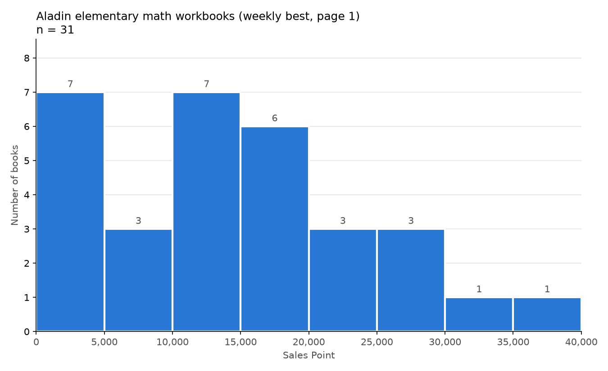
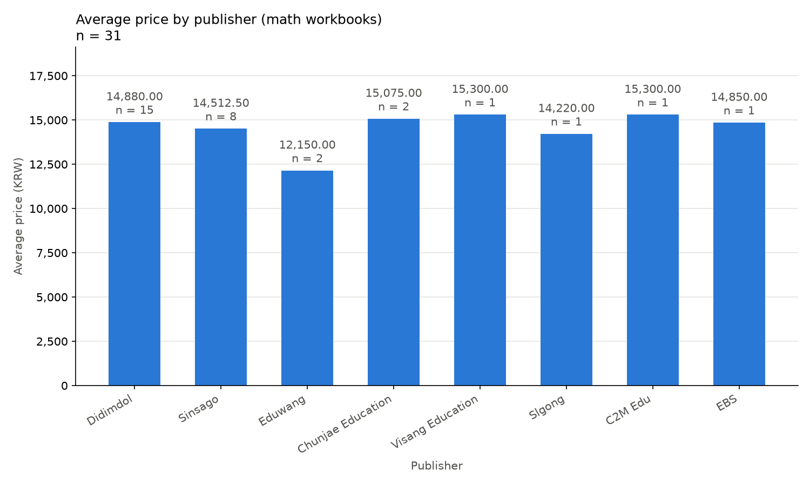

# 미니3: 초등 수학 문제집 비교 도우미

## M02 한 페이지 수집

화면에서 센 항목 50개 = 수집 50행

| 행 | 열 | CSV 값 | 원래 화면 | 같나 |
|---|---|---|---|---|
| 0 | name | 최상위 수학S 초등 5-2 (2026년) | 상세 화면 제목 최상위 수학S 초등 5-2 (2026년) | 같음 |
| 0 | price_raw | 14,400원 | 상세 화면 판매가 14,400원 | 같음 |
| 0 | publisher_raw | 디딤돌 | 상세 화면 출판사 디딤돌 | 같음 |

잘려 보이는 이름 0개 — 알라딘 목록은 이름 전체를 화면에 적고 전체 이름 속성(title 등)이 없음, 「...」「…」로 끝나는 이름도 0개

## M03 표본 3행 대조

| 표본 | 행 번호 | 이름 | 숫자 | 범주 | 확인한 곳 |
|---|---|---|---|---|---|
| 첫 행 | 0 | 같음 (최상위 수학S 초등 5-2 (2026년)) | 같음 (14,400원) | 같음 (디딤돌) | 상세 화면 |
| 가운데 행 | 25 | 같음 (EBS 초등 기본서 만점왕 국어 5-2 (2026년)) | 같음 (14,400원) | 같음 (한국교육방송공사(초등)) | 상세 화면 |
| 마지막 행 | 49 | 같음 (EBS 초등 기본서 만점왕 수학 3-2 (2026년)) | 같음 (14,850원) | 같음 (한국교육방송공사(초등)) | 상세 화면 |

판정: 3행 9칸 모두 원문과 같음

## M04 정제

생김새 조사: price_raw 모양 2가지(99,999원 45 · 9,999원 5) · sales_point_raw 3가지(99,999 31 · 9,999 18 · 999 1) · publisher_raw 15가지(출판사 이름, 숫자 없음) · 빈칸 0 · detail_url 중복 0 · 50행

규칙
1. price_raw 의 「원」과 쉼표를 떼고 정수로 바꿔 price 에
2. sales_point_raw 의 쉼표를 떼고 정수로 바꿔 sales_point 에
3. publisher_raw 는 글자 그대로 앞뒤 공백만 정리해 publisher 에
4. 못 바꾼 값은 채우지 않고 NaN, 그 행은 사유와 함께 뺌 -> 이번에는 0건

전후 숫자
| 항목 | 전 (raw.csv) | 후 (clean.csv) |
|---|---|---|
| 행 수 | 50 | 50 (뺀 행 0) |
| 데이터형 | price_raw · sales_point_raw · publisher_raw 모두 str(글자) | price Int64 · sales_point Int64 · publisher string (CSV로 다시 읽으면 int64 · int64 · str) |
| 빈칸 수 | 모든 열 0 | 모든 열 0 |
| detail_url 중복 수 | 0 | 0 |

첫 줄 손 검산
| 원문 | 손으로 바꾼 값 | clean.csv 값 | 같나 |
|---|---|---|---|
| 14,400원 | 14400 | 14400 | 같음 |
| 19,763 | 19763 | 19763 | 같음 |
| 디딤돌 | 디딤돌 | 디딤돌 | 같음 |

범주 갈림 확인: 없음 — publisher 15곳 모두 원문 모양 1가지, 공백 · 대소문자 · 괄호 안 글자를 빼고 비교해도 같아지는 묶음 0 (NE_Build & Grow 와 NE능률(참고서) 는 이름이 달라 합치지 않음)

앞뒤 공백: publisher_raw 원문 중 앞뒤 공백이 있는 값 0 · publisher != publisher_raw 인 행 0 (더 해보기 출력)

## M05 점검표와 기초 통계

**데이터 점검표**

| 점검 항목 | 처리 전 | 처리 후 | 규칙·근거 |
|---|---|---|---|
| 수집 범위 | 목록 주소 https://www.aladin.co.kr/shop/common/wbest.aspx?BestType=Bestseller&BranchType=1&CID=50246 · 1페이지 · 50행 | raw.csv 와 같음 · 50행 (정제에서 뺀 행 0) | 수집 기록서 · M04 전후 숫자 |
| 행 수 | 50 | 50 | 원본 50 - 뺀 행 0 = 정제 50 (M04 전후 숫자) |
| 숫자 열 | price_raw · sales_point_raw 모두 str(글자), 모양 price_raw 2가지(99,999원 45 · 9,999원 5) · sales_point_raw 3가지(99,999 31 · 9,999 18 · 999 1) | price Int64 · sales_point Int64 (CSV로 다시 읽으면 int64 · int64), 못 바꾼 값 0건 | M04 규칙 1 · 2 · 4, 첫 줄 손 검산 14,400원→14400 · 19,763→19763 같음 |
| 범주 열 | publisher_raw str(글자), 15가지 | publisher string (CSV로 다시 읽으면 str), 15곳, 같아지는 묶음 0 | M04 규칙 3, 범주 갈림 확인, 첫 줄 손 검산 디딤돌→디딤돌 같음 |
| 공백 | publisher_raw 앞뒤 공백 있는 값 0건 | publisher != publisher_raw 인 행 0건 | M04 규칙 3 (앞뒤 공백만 정리), 앞뒤 공백 기록 (publisher 기준) |
| 필수값 빈칸 | 0건 | 0건 | M04 전후 숫자: 빈칸 수 모든 열 0 |
| detail_url 중복 | 0건 | 0건 | M04 생김새 조사 · 전후 숫자 |
| 뺀 행 | — | 0건 | M04 규칙 4 "이번에는 0건", 행 수 50 (뺀 행 0) |
| 표본 3행 대조 | 3행(0 · 25 · 49) 9칸 모두 원문과 같음 | 미확인 (첫 행만 손 검산 3칸 같음) | M03 판정 (상세 화면 대조), M04 첫 줄 손 검산 |

**기초 통계표 (sales_point · clean.csv 50권 전체)**

| 항목 | 값 |
|---|---|
| 개수 | 50 (clean.csv 전체 행 수 50 · 같음) |
| 최소 | 467 (행 13 Reading Sketch Up 3 (Student Book + Work Book + QR code) / NE_Build & Grow) |
| 최대 | 45277 (행 16 뿌리깊은 초등국어 독해력 기본편 3단계 / 마더텅) |
| 평균 | 13916.48 |
| 중앙값 | 13309.0 |

평균 13,916.48이 중앙값 13,309.0보다 607.48 큼(중앙값의 약 4.6%) — 45,277 같은 큰 값 몇 개가 평균을 조금 위로 당겼지만, 차이가 작아 한쪽 끝에 크게 몰리지는 않았음

**튀는 값 3개**

| 무엇 | 행 번호 | 이름 | 화면 값 | sales_point_raw | sales_point | 일치 |
|---|---|---|---|---|---|---|
| 가장 작은 값 | 13 | Reading Sketch Up 3 (Student Book + Work Book + QR code) | 467 | 467 | 467 | 일치 |
| 가장 큰 값 | 16 | 뿌리깊은 초등국어 독해력 기본편 3단계 | 45,277 | 45,277 | 45277 | 일치 |
| 내가 고른 하나 (주간 1위인데 세일즈포인트는 최대의 절반에도 못 미침) | 0 | 최상위 수학S 초등 5-2 (2026년) | 19,763 | 19,763 | 19763 | 일치 |

**범주 열 값별 행 수 (`publisher` · `clean.csv` 50권 전체)**

| 출판사 | 행 수 |
| --- | --- |
| 디딤돌 | 15 |
| 좋은책신사고 | 8 |
| 한국교육방송공사(초등) | 5 |
| 동아출판 | 4 |
| 비상교육 | 4 |
| 에듀왕 | 2 |
| 마더텅 | 2 |
| 키출판사 | 2 |
| 천재교육 | 2 |
| 지학사(잡지) | 1 |
| NE_Build & Grow | 1 |
| 슬기로운공부 | 1 |
| NE능률(참고서) | 1 |
| 길벗스쿨 | 1 |
| 씨투엠에듀 | 1 |

가장 적은 범주: 1행 (6곳) · 합계 50행 (M04 더 해보기 출력에서 옮김)

## M06 EDA 질문 1 · 분포

질문: 모은 수학 문제집(도서명에 「수학」이 들어간 책)의 세일즈포인트는 어느 구간에 몰려 있나?

(그림 자리 — charts/hist.png)

| 구간 (Sales Point) | 개수 |
|---|---|
| 0 이상 5,000 미만 | 7 |
| 5,000 이상 10,000 미만 | 3 |
| 10,000 이상 15,000 미만 | 7 |
| 15,000 이상 20,000 미만 | 6 |
| 20,000 이상 25,000 미만 | 3 |
| 25,000 이상 30,000 미만 | 3 |
| 30,000 이상 35,000 미만 | 1 |
| 35,000 이상 40,000 이하 | 1 |
| **합계** | **31 = 고른 행 수 31** |

검산 — 7, 3, 7, 6, 3, 3, 1, 1 을 더해 31 · 고른 행 수 31과 같음 · 고른 31 + 나머지 19 = 50 (clean.csv 전체) · 구간 밖 값 0개
직접 센 구간 — 0 이상 5,000 미만 7권 · 표와 일치

| 구분 | 문장 |
|---|---|
| 사실 | 수학 책 31권 중 세일즈포인트 0 이상 5,000 미만과 10,000 이상 15,000 미만이 각각 7권으로, 8개 구간 중 가장 많다 |
| 추정 | 0~5,000 구간 7권 중에는 나온 지 얼마 안 돼 세일즈포인트가 아직 덜 쌓인 책이 섞여 있을 수 있다 — 확인하려면 책마다 출간 연월(목록 칸에 있지만 모으지 않음)과 알라딘이 세일즈포인트를 어떤 기간으로 계산하는지가 필요하다 (참고: 7권 중 3권은 이름에 「(2027년)」이 붙은 다음 해 1학기용) |

한계 — 이름에 「수학」이 없는 행 30 「기적의 계산법 5학년 세트」는 빠짐 · 주간 베스트 1페이지 50권 중 31권이라 알라딘 전체를 대표하지 않음

더 해보기 — 구간 폭 절반(2,500 · 16구간, charts/hist_half.png): 가장 높은 막대가 15,000 이상 17,500 미만 5권으로 바뀜 (폭 5,000에서는 0~5,000 · 10,000~15,000 각 7권). 빈도 합 31, 두 구간씩 더하면 폭 5,000 표와 같음. 한계: 구간을 어떻게 나누느냐에 따라 가장 높은 막대의 자리가 달라진다

## M07 EDA 질문 2 · 범주별 비교

**그룹 하나 손 검산**

손 검산 (에듀왕 · n = 2) — 15,300 + 9,000 = 24,300 → 24,300 ÷ 2 = 12,150 · 막대 값 12,150 · 일치
검산 그룹을 고른 이유 — 가장 작은 그룹은 n = 1 인 4곳이지만 합 ÷ 1 이라 계산기로 확인할 것이 없어, n = 2 그룹 중 평균이 가장 낮은 막대를 골랐다

**EDA 결과 카드**

| 칸 | 내용 |
|---|---|
| 질문 1 | 모은 수학 문제집의 세일즈포인트는 어느 구간에 몰려 있나 — hist.png |
| 관찰 1 | 이름에 「수학」이 든 31권을 세일즈포인트 5,000 간격 8구간으로 나누면, 0 이상 5,000 미만과 10,000 이상 15,000 미만이 각각 7권으로 가장 많다 |
| 질문 2 | 모은 수학 문제집의 판매가 평균은 출판사에 따라 어떻게 다른가 — by_category.png |
| 관찰 2 | 출판사별 평균 판매가는 에듀왕이 12,150.00원(n = 2)으로 가장 낮고, 비상교육과 씨투엠에듀가 15,300.00원(각 n = 1)으로 가장 높다 |
| 한계 | 2026-09-28 알라딘 초등학교참고서 주간 베스트 1페이지 50권 중 이름에 「수학」이 든 31권만 본 결과라, 다른 수학 문제집 · 다른 주의 순위 · 이름에 「수학」이 없는 수학책(예: 기적의 계산법 5학년 세트)은 들어 있지 않다 |

더 해보기 — 중앙값 막대(charts/by_category_median.png): 좋은책신사고가 평균 6위(14,512.50) → 중앙값 1위(16,200)로 가장 크게 바뀜. 수학 31권 중 판매가 최대 16,200(쎈 6권)과 최소 9,000 중 한 권(쎈연산 11권 6-1)이 모두 좋은책신사고에 있어, 1만 원 아래 두 권이 평균을 중앙값보다 낮춤. (M05 의 가장 큰 값은 세일즈포인트 · 국어책이라 이 그림에 없어 판매가 최대 · 최소로 봄)